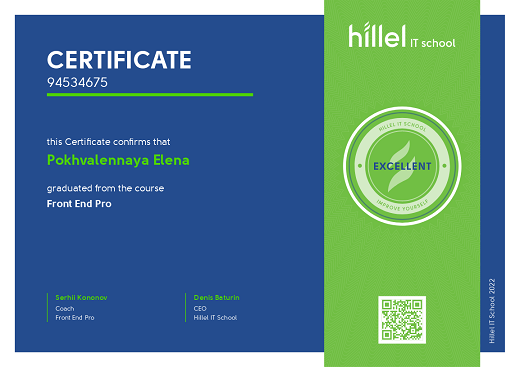

### rsschool-cv

---

## Elena Pokhvalennaya


---

### Junior Frontend Developer

---

### Contact

- **phone:** +380668794971;
- **email:** elena.pokhvalennaya@gmail.com;
- **telegram:** @lpkhvln;
- **discord:** Lena (@pokhvalennaya);
- **github:** @pokhvalennaya.

---

### About Me

My name is Lena, I am 20 years old. I am a 4th year student of the Kharkiv National University of Radioelectonics, specialty 172 telecommunications and radioengineering, educational program information and network engineering. I do not have work experience, but I want to become a professional developer.
I have such qualities as responsibility, purposefulness, friendliness, I like to learn something new and work in a team.

---

### Skills

- HTML
- CSS
- JavaScript (basic knowledge and skills)
- Node.js (basic)
- React
- TypeScript (basic)

---

### Code Example

```
function multiply(a, b){
  return a * b;
}
console.log(multiply(2,7));
```

---

### Languages

- Русский
- Українська
- English (A2)

---

### Courses

- Front End Basic at the Hillel IT school
  - [Certificate](https://certificate.ithillel.ua/view/78479775)
    
- Front End Pro at the Hillel IT school
  - [Certificate](https://certificate.ithillel.ua/view/94534675)
    
